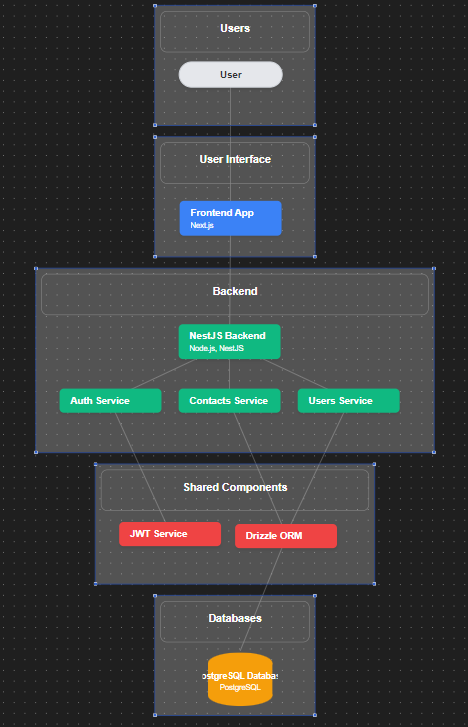

Here’s the adjusted README:

---

# Contact Manager Backend

This project is a backend service for managing contacts, built with NestJS and using PostgreSQL as the database. This guide will help you set up and run the project using Docker Compose.



## User Flow Data



## Prerequisites

- **Docker:** Ensure Docker is installed on your machine. You can download it from [here](https://www.docker.com/products/docker-desktop).
- **Docker Compose:** Docker Compose is included with Docker Desktop. Verify the installation by running `docker-compose --version`.

## Getting Started

### 1. Build and Run the Project

Run the following command to build and start the services defined in the `docker-compose.yml` file:

```bash
docker-compose up --build
```

This command will:

- Build the Docker image for the application.
- Start the PostgreSQL database service.
- Start the application service.

### 2. Access the Application

Once the services are up and running, you can access the backend application at [http://localhost:4000](http://localhost:4000).

The front-end application built with Next.js can be accessed at [http://localhost:3000](http://localhost:3000).

### 3. API Documentation

The API documentation is available at [http://localhost:4000/api](http://localhost:4000/api). This documentation is generated using Swagger and provides details about the available endpoints and their usage.

## Additional Commands

### Stop the Services

To stop the running services, use the following command:

```bash
docker-compose down
```

### View Logs

To view the logs of the running services, use the following command:

```bash
docker-compose logs -f
```

### Rebuild the Services

If you make changes to the code and need to rebuild the services, use the following command:

```bash
docker-compose up --build
```

## Conclusion

This guide provides the necessary steps to set up and run the Contact Manager Backend project using Docker Compose. If you encounter any issues or have questions, please refer to the project's documentation or contact the maintainers for assistance.

---

Feel free to make any further adjustments!
